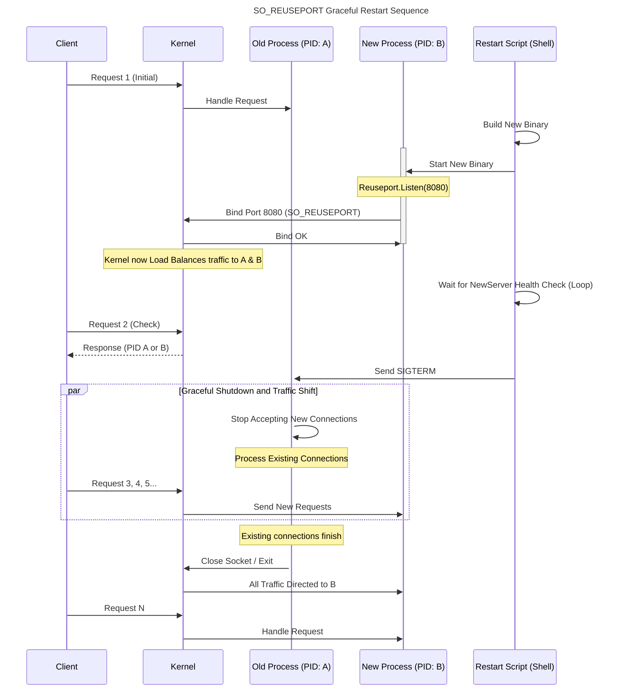

# Go Graceful Restart (Zero-Downtime) PoC

This document outlines PoC for achieving **Zero-Downtime Graceful Restart** using the `SO_REUSEPORT` socket option in a Go HTTP server.

By utilizing the kernel-level load balancing feature of a **Linux environment (such as Docker)**, a new server process can bind to the same port as the old server process while the old one is still running, allowing traffic handover.

## Sequence

The flow below illustrates the steps for a graceful restart using `SO_REUSEPORT`.



## Feature

- **SO_REUSEPORT Activation:** To ensure cross-platform compatibility, the `github.com/libp2p/go-reuseport` library is used to enable the `SO_REUSEPORT` option.
- **Graceful Shutdown:** Upon receiving a `SIGTERM` signal, the server waits for existing connections/requests to complete before terminating.
- **PID-Based Load Balancing:** Accessing the server's `/` endpoint returns the Process ID (PID) handling the request, allowing verification that requests are being **distributed by the kernel** across multiple processes.

## Setup

### Initial

```bash
git clone <this_repo_url> go-reuseport-poc
cd go-reuseport-poc
go mod tidy
```

## Steps

### 1. Build Docker Image

Build the Docker image using the provided `Dockerfile`. This is essential for utilizing the Linux kernel's `SO_REUSEPORT` functionality.

```bash
docker build -t go-reuseport-poc .
```

### 2. Start Container And Login Shell

Start the container and map port 8080. Then, enter the container's shell environment.

```bash
docker run -d --name reuse-poc -p 8080:8080 go-reuseport-poc
docker exec -it reuse-poc bash
```

**All subsequent commands should be executed inside the container's shell.**

### 3. Initial Startup

Start the first server instance.

```bash
# The binary is already built within the container
./server &
echo $! > server.pid
```

### 4. Verification (Load Balancing Check)

Execute `curl` a few times and confirm the response contains a PID, ensuring the initial server is running.

```bash
curl http://localhost:8080
# => OK. Handled by PID: 12345 (Example)
```

### 5. Execute Zero-Downtime Restart

Execute the `scripts/restart.sh` script. This script starts the new binary, waits for it to become healthy, and then sends a graceful termination signal to the old process.

```bash
sh ./scripts/restart.sh
```

**In-Progress Verification:**
While the restart script is running, execute `curl` continuously in a **separate terminal on the host OS** (or in the container).

1. Initially, the old PID is returned.
2. Once the new process starts, the new PID will start appearing **randomly** in the responses.
3. After the old process completes its graceful shutdown, only the new PID will be returned.

<!-- end list -->

```bash
# Example Output during the handover:
curl http://localhost:8080 # -> PID: 12345 (Old)
curl http://localhost:8080 # -> PID: 54321 (New)
curl http://localhost:8080 # -> PID: 12345 (Old)
# ... after a short period ...
curl http://localhost:8080 # -> PID: 54321 (New)
curl http://localhost:8080 # -> PID: 54321 (New)
```
