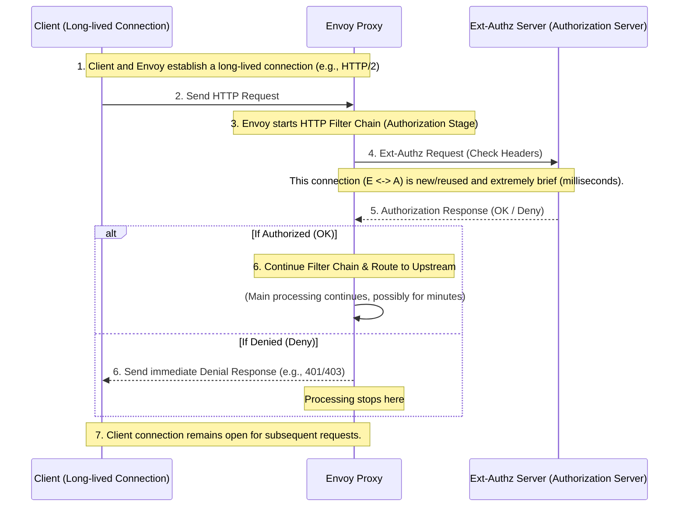

# Envoy vs Ext-Authz: Zero Downtime Deployment Strategies

- [Envoy vs Ext-Authz: Zero Downtime Deployment Strategies](#envoy-vs-ext-authz-zero-downtime-deployment-strategies)
  - [1. Why "Long-Lived" Connections are a Problem](#1-why-long-lived-connections-are-a-problem)
  - [2. Why Ext-Authz Requests are "Short-Lived"](#2-why-ext-authz-requests-are-short-lived)
    - [Processing Sequence: Separation of Envoy and Ext-Authz](#processing-sequence-separation-of-envoy-and-ext-authz)
    - [Key Takeaways from the Sequence](#key-takeaways-from-the-sequence)
  - [3. Ext-Authz ZDD Strategy: Socket Passing is Unnecessary](#3-ext-authz-zdd-strategy-socket-passing-is-unnecessary)

## 1. Why "Long-Lived" Connections are a Problem

Envoy adopts Socket Passing (Hot Restart) mainly because the connections between the client and Envoy (HTTP/2, gRPC, WebSocket) are **long-lived**, lasting from hours to days. If these connections were terminated during deployment, it would directly impact users.

## 2. Why Ext-Authz Requests are "Short-Lived"

The Ext-Authz (External Authorization) filter is called synchronously early in Envoy's **HTTP filter chain**. This process is logically separate from the main request processing, and the connection between Envoy and the Authz server is **not directly related** to the user's long-lived connection.

### Processing Sequence: Separation of Envoy and Ext-Authz

The Ext-Authz authorization request occurs immediately after Envoy reads the headers of the request received from the client, meaning it happens during a **very brief period immediately after the client connection is established**.

### Key Takeaways from the Sequence

| Item | Client \leftrightarrow Envoy | Envoy \leftrightarrow Ext-Authz |
| --- | --- | --- |
| **Connection Lifetime** | Long-lived (hours to days) | **Short-lived** (milliseconds) |
| **Impact of Deployment** | **Major Issue.** Termination impacts users. | **Minor Issue.** Connection pool loss can be quickly re-established. |
| **Mitigation** | Requires Socket Passing (Hot Restart). | **Standard Graceful Shutdown is sufficient.** |

## 3. Ext-Authz ZDD Strategy: Socket Passing is Unnecessary

The downtime that must be avoided during Ext-Authz server deployment is the **temporary inability of the server to accept requests**. This would cause authorization requests from Envoy to immediately result in errors like `503`.

Since there is no long-lived connection challenge, ZDD for the Ext-Authz server can be sufficiently achieved using the following **infrastructure/orchestration-level features**:

1. **Refusal of New Connections:**
   1. **Kubernetes:** Kubelet removes the Pod from the Endpoints list, and Envoy instantly stops routing traffic.
   2. **VM/Systemd (`SO_REUSEPORT`):** By closing the listening socket upon receiving `SIGTERM`, the OS kernel instantly switches new authorization requests to the new version.
2. **Draining Existing Connections:**
   1. Upon receiving `SIGTERM`, the Ext-Authz server waits for in-flight **short-lived authorization requests** to complete (e.g., within a 30-second grace period) and then safely exits.

Therefore, for Ext-Authz server deployment, **there is no need to incur the complex cost of implementing Socket Passing in the application code.** The focus should instead be on the traditional Graceful Shutdown logic.
