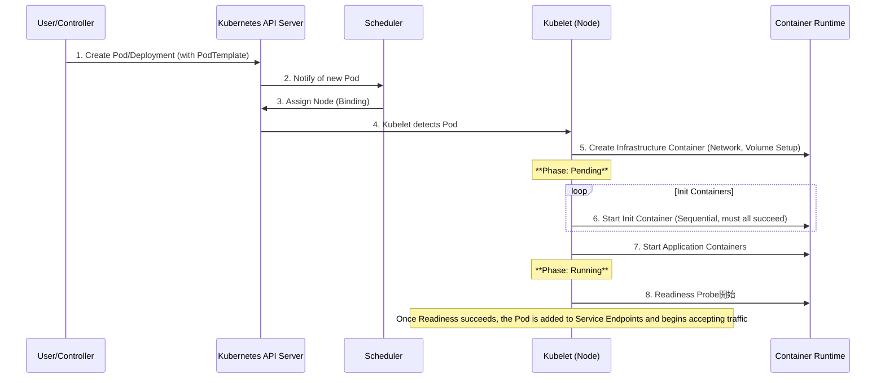
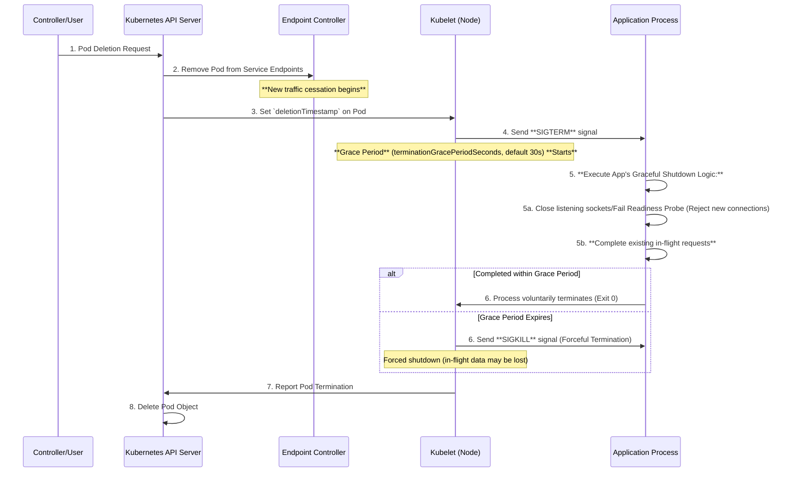

# Kubernetes Pod Lifecycle and Graceful Shutdown

- [Kubernetes Pod Lifecycle and Graceful Shutdown](#kubernetes-pod-lifecycle-and-graceful-shutdown)
  - [Refs](#refs)
  - [1. Pod Basics and Phases](#1-pod-basics-and-phases)
  - [2. Pod Startup Sequence](#2-pod-startup-sequence)
  - [3. Graceful Shutdown System Design](#3-graceful-shutdown-system-design)
    - [3.1. Graceful Termination Sequence](#31-graceful-termination-sequence)
    - [3.2. Core Principles for Application Implementation](#32-core-principles-for-application-implementation)
  - [Summary](#summary)

This document explains the Kubernetes Pod lifecycle using a Mermaid sequence diagram and clarifies the core system design principles required for implementing a **Graceful Shutdown**.

## Refs

- https://kubernetes.io/docs/concepts/workloads/pods/

## 1. Pod Basics and Phases

A Pod models a single logical host, encapsulating one or more containers, shared networking, and storage. Pods managed by the Kubelet transition through the following main phases:

| Phase | Description |
| --- | --- |
| **Pending** | The Pod has been accepted by the Kubernetes system but one or more of the containers has not been created or is not ready to run. This includes time spent waiting for scheduling and image download. |
| **Running** | The Pod has been bound to a node, and at least one container is running or is in the process of starting. |
| **Succeeded** | All containers in the Pod have successfully terminated and will not be restarted. |
| **Failed** | All containers in the Pod have terminated, and at least one container has terminated in failure. |

## 2. Pod Startup Sequence

This is the typical sequence from Pod creation until the application is ready to serve traffic.

## 3. Graceful Shutdown System Design

The goal of a Graceful Shutdown is to safely complete in-flight work and reject new traffic **within a configured grace period**.

### 3.1. Graceful Termination Sequence

The process from a Pod deletion request to the Kubelet terminating the application is managed under strict time limits.

### 3.2. Core Principles for Application Implementation

The application must be designed with the knowledge of the **Grace Period** in mind.

1. **Immediate Rejection of New Connections (Draining)**
   - Upon receiving `SIGTERM`, the application must **immediately stop listening for new external TCP connections** (close listening sockets).
   - Concurrently, the application should cause the `Readiness Probe` to fail, prompting Kubernetes to swiftly remove the Pod from the Endpoint list.

2. **Completion of Existing Connections (Waiting)**
   - After rejecting new connections, existing established connections and in-flight requests (e.g., active transactions) **must be completed**.
   - The time spent waiting for this completion **must not exceed** the `terminationGracePeriodSeconds` (default 30 seconds). This is the maximum allowed processing time.

3. **Voluntary Process Exit**
   - Once all processing is safely complete, the application should **voluntarily terminate (Exit)** without waiting for the grace period to expire.
   - **Crucial**: The correct definition of a Graceful Shutdown in Kubernetes is **waiting for completion within a time limit (the Grace Period), not waiting indefinitely for all connections to cease**. If the period is exceeded, the Kubelet will force termination.

This design ensures the application maintains data integrity while terminating safely, without compromising overall system availability.

## Summary

1. Kube Delete Request
   1. A user or controller initiates the Pod deletion (e.g., kubectl delete).
2. Removal from Service Routing
   1. The Pod's IP is immediately removed from the Service Endpoints list by the Endpoint Controller.
3. SIGTERM Sent by Kubelet
   1. The Kubelet sends the SIGTERM signal to the container's main process and starts the Grace Period countdown (default 30 seconds).
4. Application Executes Shutdown Logic
   1. The application captures SIGTERM, stops accepting new connections, and begins completing existing in-flight requests.
5. Forced Termination (SIGKILL)
   1. If the process is not finished (exited) within the 30-second Grace Period, the Kubelet sends a SIGKILL signal, forcibly terminating the process.
