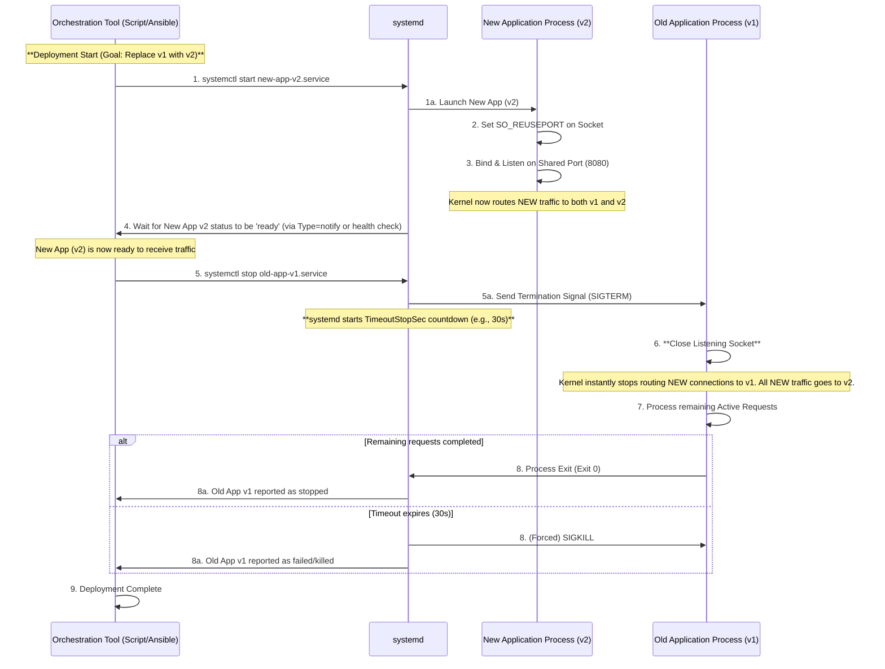

# `systemd`: `SO_REUSEPORT`

- [`systemd`: `SO_REUSEPORT`](#systemd-so_reuseport)
  - [Sequence Changes and Notes in the Systemd Environment](#sequence-changes-and-notes-in-the-systemd-environment)
    - [Main Changes and Notes](#main-changes-and-notes)
  - [Implementation](#implementation)

## Sequence Changes and Notes in the Systemd Environment

The following two points are the main changes when operating in a `systemd` environment:

1. **Actor for Starting/Stopping Services:** The Orchestration Tool (O) issues commands via `systemd` instead of directly commanding the processes (NewApp, OldApp).
2. **Grace Period Management:** `systemd` takes responsibility for forceful termination (`SIGKILL`) based on `TimeoutStopSec`.

Below is a more detailed sequence that incorporates coordination with `systemd`.



### Main Changes and Notes

1. **Delegation of Responsibility (Steps 1, 5, 8):**
   1. In the original sequence, orchestration (O) directly started and stopped the apps. In a `systemd` environment, O sends commands via **`systemctl`** to `systemd`, and `systemd` handles the actual process management (launching, sending `SIGTERM`, executing `SIGKILL`).
2. **Management of `TimeoutStopSec` (Steps 5a, 8):**
   1. `systemd` starts the `TimeoutStopSec` timer (e.g., 30 seconds) specified in the configuration file (`.service`) the moment it sends `SIGTERM`.
   2. The responsibility and actor for forceful termination (`SIGKILL`) is **`systemd`**, not the orchestration tool.
3. **Process Name Management:**
   1. To achieve this hot deployment, the orchestration tool must either manage **the old and new processes with different `systemd` unit names** or track process IDs externally to `systemd` and have the logic to switch between the old and new versions.

In summary, the **traffic switchover logic using `SO_REUSEPORT` (closing the listener)** remains unchanged within the application, but its triggering and monitoring are performed through `systemd`.

## Implementation

```bash
# Example: Logic to manage the "current production" via a symbolic link
# /etc/systemd/system/app.service -> /etc/systemd/system/app-blue.service

# 1. Check the current target (Assume Blue is running)
CURRENT=$(readlink -f /etc/systemd/system/app.service)

# 2. Start the opposite side (Green)
systemctl start app-green.service

# 3. When Green is ready, atomically replace the symbolic link
ln -sfn /etc/systemd/system/app-green.service /etc/systemd/system/app.service
systemctl daemon-reload

# 4. Stop the old one (Blue)
systemctl stop app-blue.service
```
