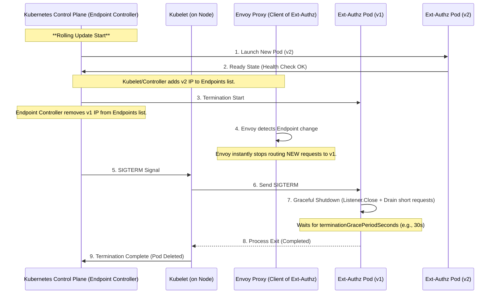
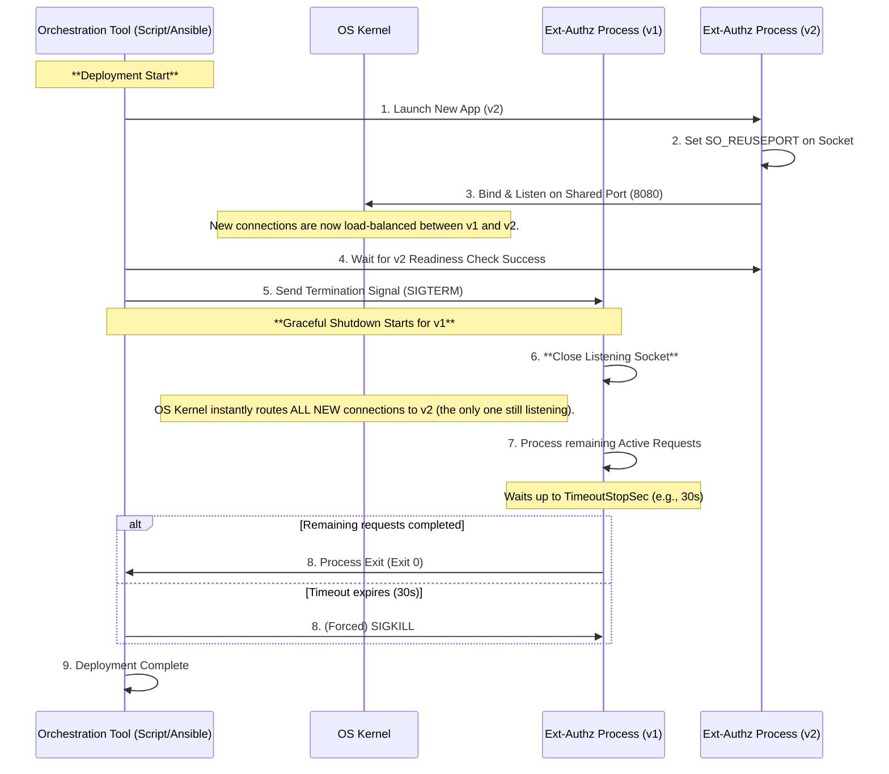
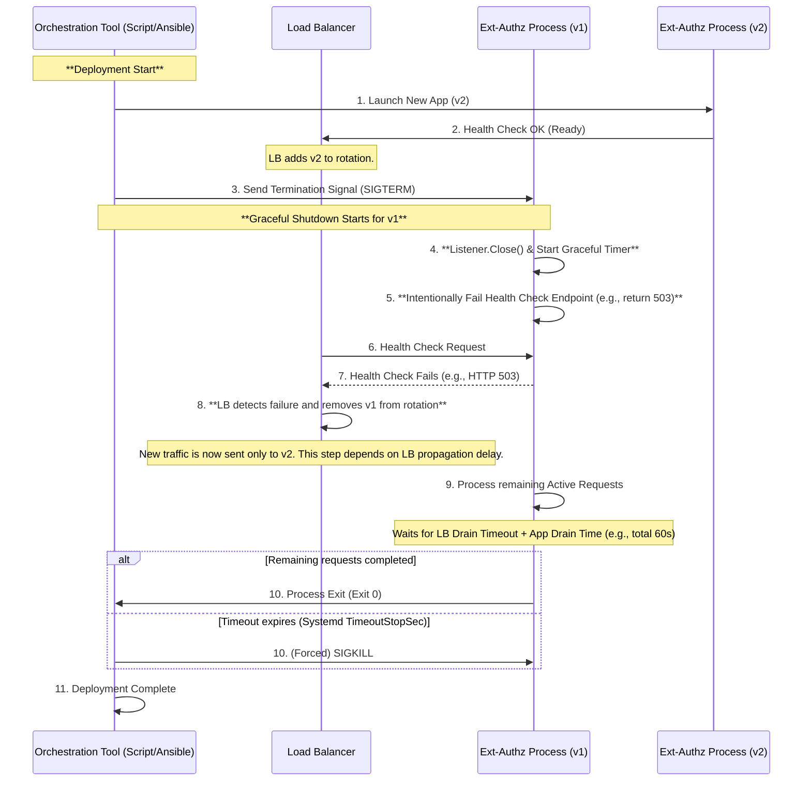

# Ext-Authz Zero Downtime Deployment Strategy

- [Ext-Authz Zero Downtime Deployment Strategy](#ext-authz-zero-downtime-deployment-strategy)
  - [1. Kubernetes Environment (Standard Best Practice)](#1-kubernetes-environment-standard-best-practice)
  - [2. VM/Systemd Environment (Using SO\_REUSEPORT)](#2-vmsystemd-environment-using-so_reuseport)
  - [3. VM/Systemd Environment (Without SO\_REUSEPORT)](#3-vmsystemd-environment-without-so_reuseport)
    - [Processing Sequence: Graceful Shutdown with LB Coordination](#processing-sequence-graceful-shutdown-with-lb-coordination)
    - [Decisive Difference from `SO_REUSEPORT`](#decisive-difference-from-so_reuseport)
  - [Conclusion](#conclusion)

Since the Ext-Authz server does not have long-lived connections, complex **application implementation** like Socket Passing, which Envoy uses, **is unnecessary**. Instead, adopting a standard Zero Downtime Deployment (ZDD) strategy utilizing **orchestration and infrastructure layer features** is the best approach.

## 1. Kubernetes Environment (Standard Best Practice)

Kubernetes' Rolling Update feature achieves ZDD without application modification by manipulating the Endpoints list. This mechanism is highly effective because the Ext-Authz Pod's IP address is the routing target for Envoy.

| Step | Action | ZDD Guarantee |
| --- | --- | --- |
| **New Traffic Switchover** | The Endpoint Controller **immediately removes** the v1 IP address from the **Endpoints list** (Step 4). | **Envoy instantly** starts sending requests only to the new Pod (v2). |
| **Drain** | v1 receives `SIGTERM` and completes **short** in-flight requests within the grace period (e.g., 30s) before exiting (Step 7). | In-flight authorization requests are not interrupted. |

## 2. VM/Systemd Environment (Using SO_REUSEPORT)

`SO_REUSEPORT` is the cleanest approach in a VM environment because traffic can be switched instantly using OS kernel features, without relying on load balancer latency.

| Step | Action | ZDD Guarantee |
| --- | --- | --- |
| **New Traffic Switchover** | The OS kernel instantly switches new requests to v2 the **moment v1 closes its listening socket** (Step 6). | Stops accepting new requests **at the fastest speed** without relying on external LB propagation delay. |
| **Drain** | v1 completes in-flight **short-lived** requests before exiting (Step 7). | In-flight authorization requests are not interrupted. |

## 3. VM/Systemd Environment (Without SO_REUSEPORT)

As previously discussed, for a VM/Systemd environment without `SO_REUSEPORT`, the alternative zero-downtime deployment strategy relies on **Load Balancer (LB) Coordination**.

This method intentionally manipulates the application's **health check response** to force the LB to switch traffic.

### Processing Sequence: Graceful Shutdown with LB Coordination

### Decisive Difference from `SO_REUSEPORT`

| Item | Using `SO_REUSEPORT` | Using LB Coordination |
| --- | --- | --- |
| **Traffic Switcher** | **OS Kernel** | **Load Balancer (LB)** |
| **Switch Reliability/Speed** | **Instantaneous.** The moment v1 closes the listener. | **Delayed.** Depends on the time it takes for the LB to retry the health check and propagate the change across the network (tens of seconds). |
| **Application Role** | Close the listener upon `SIGTERM`. | Close the listener **and intentionally fail the health check** upon `SIGTERM`. |

For this reason, from a ZDD perspective, **using `SO_REUSEPORT` is superior** because it avoids LB propagation delay.

## Conclusion

Downtime for the Ext-Authz server must be avoided, but since it lacks long-lived connections, **overhead-intensive techniques like Socket Passing are unnecessary.**

Adopting a standard ZDD strategy using **Kubernetes Rolling Update** or **`SO_REUSEPORT` with orchestration in a VM environment** is the most efficient approach.
