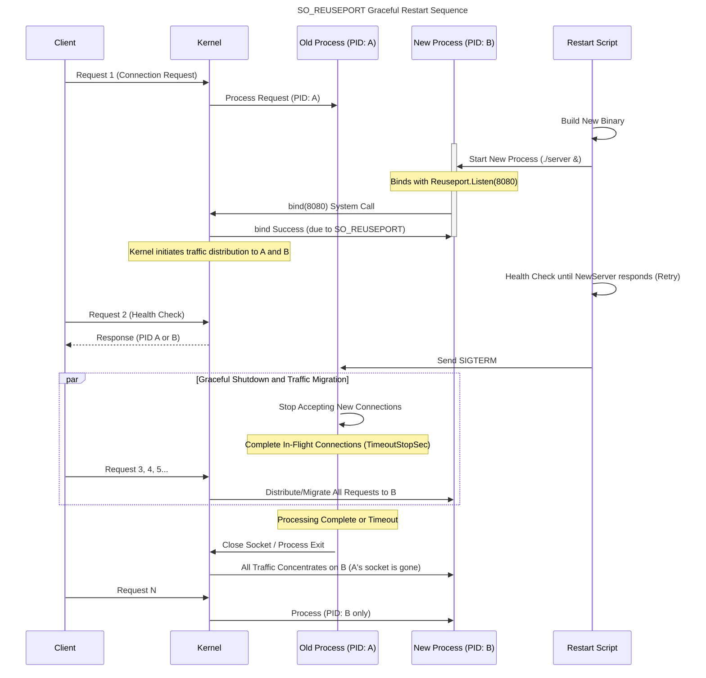

# Listener vs File Descriptor

- [Listener vs File Descriptor](#listener-vs-file-descriptor)
  - [1. What is a Listener?](#1-what-is-a-listener)
  - [2. Listener vs. FD (File Descriptor)](#2-listener-vs-fd-file-descriptor)
    - [Sequence](#sequence)

## 1. What is a Listener?

The **Listener** is a fundamental object in network programming, and its primary roles are twofold:

1. **Port Reservation and Waiting**: To request a specific IP address and port number (e.g., `0.0.0.0:8080`) from the OS and continuously wait for incoming connection requests (inbound traffic).
2. **Connection Acceptance (Accept)**: When a new client connection request arrives, to accept it and create a dedicated **connection socket** for subsequent communication, passing it to the application layer.

In the Go language, the `net.Listener` interface returned by the `net.Listen()` function fulfills this role.

## 2. Listener vs. FD (File Descriptor)

For the Listener to wait for connections on a port, a **socket** object is created internally within the OS kernel. In UNIX-like operating systems (Linux, macOS, etc.), **all I/O resources**, including this socket, are managed by an integer value called the **FD (File Descriptor)**.

In essence, the **Listener object encapsulates the FD that points to the socket within the kernel.**

| Element | Role | Representation |
| :--- | :--- | :--- |
| **Listener** | Application-side object. Waits for and accepts external connection requests. | `net.Listener` interface in Go. |
| **FD (File Descriptor)** | An integer value used by the OS kernel to uniquely identify a socket. | Directly points to the network socket itself. |

The state of a Listener "waiting for connections" means that **its FD has instructed the OS kernel to "notify me when a connection arrives on this port."**

### Sequence

When an application, such as one written in Go, calls `net.Listen("tcp", ":8080")`, the following occurs internally:

1. **System Calls**: The Go runtime executes the `socket()` and `bind()` system calls on the OS kernel.
2. **FD Creation**: The kernel creates a socket bound to port 8080 and assigns a new FD number (e.g., 3, 4, or 5) to identify it.
3. **Listening**: The application uses that FD number to issue the `listen()` system call, instructing the kernel to enter the connection waiting state.
4. **Listener Construction**: The Go runtime constructs the `net.Listener` object, which internally holds this FD number, and returns it to the application.

Therefore, the statement that "the Listener internally waits using an FD" is an **accurate description of the operational principle.**

