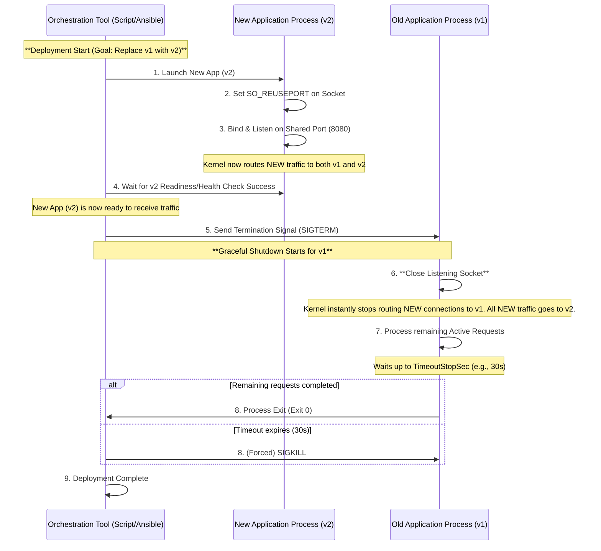

# Graceful Shutdown using `SO_REUSEPORT`

- [Graceful Shutdown using `SO_REUSEPORT`](#graceful-shutdown-using-so_reuseport)
  - [VM Sequence](#vm-sequence)
    - [Key Points of the Sequence and the Role of Orchestration](#key-points-of-the-sequence-and-the-role-of-orchestration)

## VM Sequence

This diagram illustrates the orchestration flow during a new version deployment, showing how the old process is stopped and traffic is instantly switched to the new process.

### Key Points of the Sequence and the Role of Orchestration

1. **Simultaneous Binding (Steps 2, 3):**
   1. `SO_REUSEPORT` allows the new application (v2) to bind to the same port as the old application (v1). This enables the new process to start up without interrupting traffic.
2. **Instant of Traffic Switchover (Step 6):**
   1. When the orchestration layer sends `SIGTERM` (Step 5) and the application (v1) **closes its listening socket** (Step 6), the kernel automatically switches the routing of **new connections** exclusively to the surviving new process (v2).
   2. At this moment, no coordination with an external load balancer is required, and the **zero-downtime** switchover is complete.
3. **Responsibility for Shutdown (Steps 7, 8):**
   1. The old process (v1), after stopping its listener, is responsible for completing any existing in-flight processing within the configured grace period.
   2. The orchestration tool waits for the process to exit voluntarily.
