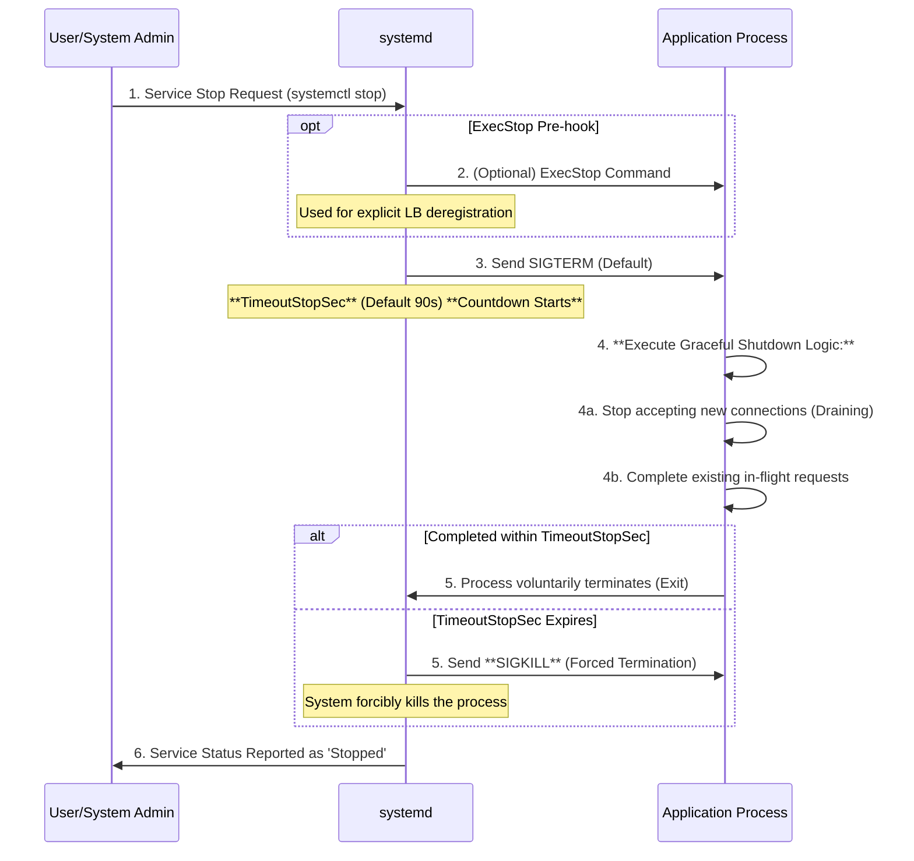

# Graceful Shutdown using Systemd in VM Environments

- [Graceful Shutdown using Systemd in VM Environments](#graceful-shutdown-using-systemd-in-vm-environments)
  - [1. Systemd Service Termination Sequence](#1-systemd-service-termination-sequence)
  - [2. Common Design Philosophy with Kubernetes](#2-common-design-philosophy-with-kubernetes)
    - [Control Settings in the Systemd Service File](#control-settings-in-the-systemd-service-file)
  - [3. Graceful Shutdown Implementation and Application Responsibility in VM](#3-graceful-shutdown-implementation-and-application-responsibility-in-vm)
  - [Conclusion: The Core of Application Implementation](#conclusion-the-core-of-application-implementation)
    - [1. Network Disconnection (Connection Draining)](#1-network-disconnection-connection-draining)
    - [2. Grace Period Configuration](#2-grace-period-configuration)
  - [3. SIGTERM Handling (Crucial for Coordination)](#3-sigterm-handling-crucial-for-coordination)

The design philosophy of "safe and quick service termination," established in Kubernetes, is directly applicable to VM environments.

## 1. Systemd Service Termination Sequence

The Mermaid sequence diagram below illustrates the fundamental shutdown lifecycle when `systemd` receives a service stop command (e.g., `systemctl stop <service>`).

## 2. Common Design Philosophy with Kubernetes

"While Kubernetes' `terminationGracePeriodSeconds` defaults to 30 seconds, `systemd`'s default stop timeout (`TimeoutStopSec`) is set longer at 90 seconds.

However, for latency-sensitive applications like Web services and APIs, the shorter 30-second duration should be intentionally applied within `systemd` to balance **safety and rapid resource release**.

### Control Settings in the Systemd Service File

To control service termination behavior and achieve a rapid, safe shutdown compatible with Kubernetes' standards, configure the following directives in the service file (`.service`):

| Directive | Description | Recommended Setting (30-second rule) |
| --- | --- | --- |
| **`KillMode`** | Defines which processes receive the signal. `control-group` is recommended to ensure the signal reaches the main process and all its children. | `KillMode=control-group` |
| **`TimeoutStopSec`** | Grace period between sending `SIGTERM` and `SIGKILL`. Aligns with standard Web service SLAs. | `TimeoutStopSec=30s` |
| **`ExecStop`** | Custom command executed **before** `SIGTERM`. Can be used for explicit network isolation. | N/A (Only used if application doesn't handle LB deregistration) |

## 3. Graceful Shutdown Implementation and Application Responsibility in VM

In a VM environment, the automatic network isolation feature found in Kubernetes (like the Endpoint Controller) is absent. Therefore, **network disconnection during service shutdown** must be guaranteed by the application and `systemd` configuration.

| Step | Action | Systemd/Application Responsibility |
| --- | --- | --- |
| **1. Network Isolation** | Ensure the service stops accepting new traffic (start connection draining). | **Application fails its health check** to wait for the Load Balancer (LB) to remove the VM (Recommended). Alternatively, use `ExecStop` to call an LB API for explicit deregistration. |
| **2. `SIGTERM` Sent** | `systemd` sends `SIGTERM` to the application. | `systemd` executes automatically. |
| **3. Termination Processing** | The application completes existing requests within `TimeoutStopSec`. | Requires setting `TimeoutStopSec=30s` and implementing a **`SIGTERM` handler** in the application for waiting/completion logic. |

## Conclusion: The Core of Application Implementation

In a VM environment, the roles that Kubelet and controllers **handle automatically** in Kubernetes must be performed by the **application itself**.

To achieve Graceful Shutdown in a VM environment, the application must implement logic that catches `SIGTERM` and executes the following steps:

### 1. Network Disconnection (Connection Draining)

This is the most significant difference between Kubernetes and VM environments and the part where the VM application must be proactive.

| Action | Kubernetes Environment | VM / Systemd Environment (Required Implementation) |
| --- | --- | --- |
| **New Traffic Blockage** | **Kubernetes executes automatically**. The Endpoint Controller instantly removes the Pod's IP from the Endpoints list. | **The application must handle this itself**. Upon receiving `SIGTERM`, it must voluntarily stop accepting new connections and inform the external Load Balancer (LB) of its status. |
| **Method** | Automatic removal by Kubelet. | The application must implement one of the following: |
| **Ideal Implementation** | N/A | **Health Check Failure:** When `SIGTERM` is received, the application's health check API should return an error (e.g., HTTP 503). The LB monitors this and automatically removes the VM from routing. |
| **Alternative Implementation** | N/A | **`ExecStop` Hook and External API Call:** Use the `ExecStop` directive in `systemd` to run a script that calls the LB's API to forcibly deregister the VM from the pool. |

**Conclusion:** In Kubernetes, "removal from routing" is the infrastructure's responsibility. In a **VM, it is the application's responsibility** (or the responsibility of coordination via `systemd` hooks).

### 2. Grace Period Configuration

In Kubernetes, this is set in the Pod Spec; in a VM, it is set in the `systemd` Unit file, and the application must respect this value.

| Action | Kubernetes Environment | VM / Systemd Environment (Required Configuration) |
| --- | --- | --- |
| **Grace Period Setting** | Set via `terminationGracePeriodSeconds` in the Pod Spec. | Set via `TimeoutStopSec=30s` (or similar) in the **`systemd` Unit file**. |
| **Forced Termination Logic** | Kubelet manages the timer and sends `SIGKILL`. | **`systemd` manages the timer** and sends `SIGKILL`. |

**Conclusion:** Rather than the application itself, the **infrastructure configuration file (the Unit file)** must explicitly state the maximum acceptable termination time (e.g., 30 seconds).

## 3. SIGTERM Handling (Crucial for Coordination)

While the logic for handling `SIGTERM` is the same in both environments, coordination with network isolation is vital in the VM context.

| Action | Kubernetes Environment | VM / Systemd Environment (Coordination is Key) |
| --- | --- | --- |
| **Execute Shutdown Logic** | Catch `SIGTERM` and execute logic to reject new connections and complete existing work. | Implement the **exact same logic**. |
| **Coordination** | Coordinated with automatic routing removal by Kubelet. | **The application must ensure** that the network isolation from **Step 1 has occurred** (or initiate processing simultaneously). |

In summary, the key element the application must proactively implement to achieve Kubernetes-equivalent Graceful Shutdown in a VM is the **handling of disconnection from the load balancer or routing system** upon receiving `SIGTERM`.
