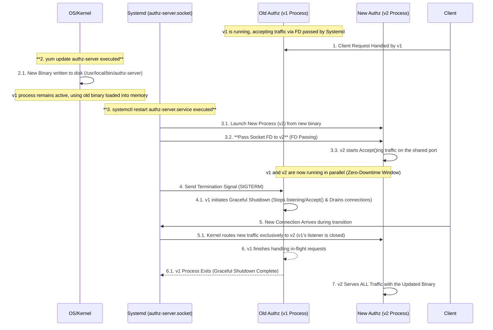

# Systemd: Socket Activation

- [Systemd: Socket Activation](#systemd-socket-activation)
  - [Overview](#overview)
  - [Sequence](#sequence)
  - [Steps](#steps)
    - [1. Go Code Modification](#1-go-code-modification)
    - [2. Create Socket Unit (`my-app.socket`)](#2-create-socket-unit-my-appsocket)
    - [3. Create Service Unit (`my-app.service`)](#3-create-service-unit-my-appservice)
    - [4. Execution Commands](#4-execution-commands)
    - [Who Handles the Kill?](#who-handles-the-kill)

## Overview

In a normal `systemctl restart`, Systemd terminates the old process before starting the new one, resulting in a brief downtime.

However, by utilizing **Socket Activation**, Systemd holds the listening socket, and the socket remains open even during a restart. When the new process starts, Systemd passes the **socket File Descriptor (FD)** to the new process, which then uses it to accept traffic.

## Sequence



## Steps

We assume the Go binary is located at `/usr/local/bin/my-app` and uses port 8080.

### 1. Go Code Modification

The Go code (`main.go`) must be modified to **reconstruct the listener using the FD passed by Systemd**.

```go
// main.go Listener Creation Modification (for Systemd compatibility)
import "os"
// ...
func main() {
    // Systemd passes LISTEN_FDS environment variable and the FD index (0)
    // We switch from SO_REUSEPORT to FD Inheritance logic here
    if os.Getenv("LISTEN_FDS") != "" {
        // Reconstruct the listener using the passed FD (index 0 corresponds to FD 3 by systemd convention)
        f := os.NewFile(uintptr(3), "") 
        listener, _ := net.FileListener(f)
        // ...
    } else {
        // Normal startup (fallback, if not started by systemd)
        listener, _ := net.Listen("tcp", ":8080")
    }
    // ...
}
```

### 2. Create Socket Unit (`my-app.socket`)

This defines the socket configuration and the `SO_REUSEPORT` option.

`/etc/systemd/system/my-app.socket`

```ini
[Unit]
Description=My Application Socket (8080)

[Socket]
# Wait for TCP connections on port 8080
ListenStream=8080

# ★ Have Systemd set the SO_REUSEPORT option ★
# This allows multiple my-app.service instances to share the port
SocketOptions=SO_REUSEPORT

# Define which service to launch upon connection (or restart)
Service=my-app.service

[Install]
WantedBy=sockets.target
```

### 3. Create Service Unit (`my-app.service`)

This defines the application's launch configuration.

`/etc/systemd/system/my-app.service`

```ini
[Unit]
Description=My Application Service
# Set dependency so my-app.socket starts first
Requires=my-app.socket

[Service]
# Path to the Go binary
ExecStart=/usr/local/bin/my-app

# Set service type compatible with Socket Activation
Type=notify

# Graceful termination via SIGTERM
KillMode=mixed
TimeoutStopSec=10s

# Defines that the service will be activated by this socket
# Systemd will pass the socket FD
Sockets=my-app.socket

# Environment settings
User=app_user
Group=app_user
Restart=on-failure

[Install]
WantedBy=multi-user.target
```

### 4. Execution Commands

1. **Reload configuration files**:

    ```bash
    sudo systemctl daemon-reload
    ```

2. **Enable the socket**:

    ```bash
    sudo systemctl enable my-app.socket
    ```

3. **Start the service (via socket)**:

    ```bash
    sudo systemctl start my-app.socket
    ```

4. **Zero-Downtime Restart**:

    ```bash
    # Systemd gracefully terminates the old process and starts the new one
    sudo systemctl restart my-app.service
    ```

### Who Handles the Kill?

In the socket activation scenario, **Systemd handles the Kill**.

1. The `systemctl restart my-app.service` command is executed.
2. Systemd sends a `SIGTERM` to the old process **before** killing it.
3. The Go binary receives `SIGTERM` and executes its Graceful Shutdown logic (`server.Shutdown()`), completing in-flight requests and terminating voluntarily.
4. The new process, already started and accepting traffic using the FD passed by Systemd, ensures zero downtime.
